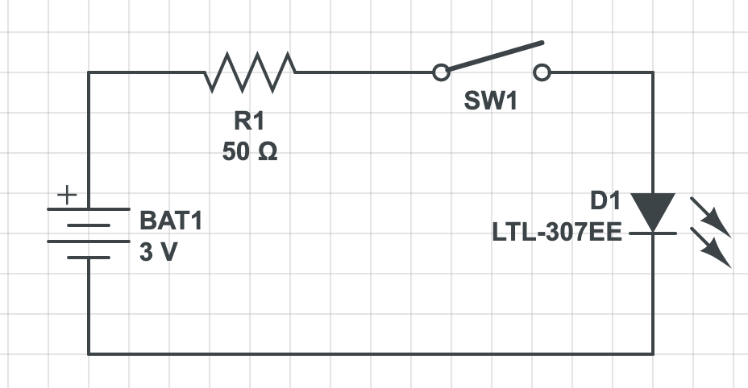
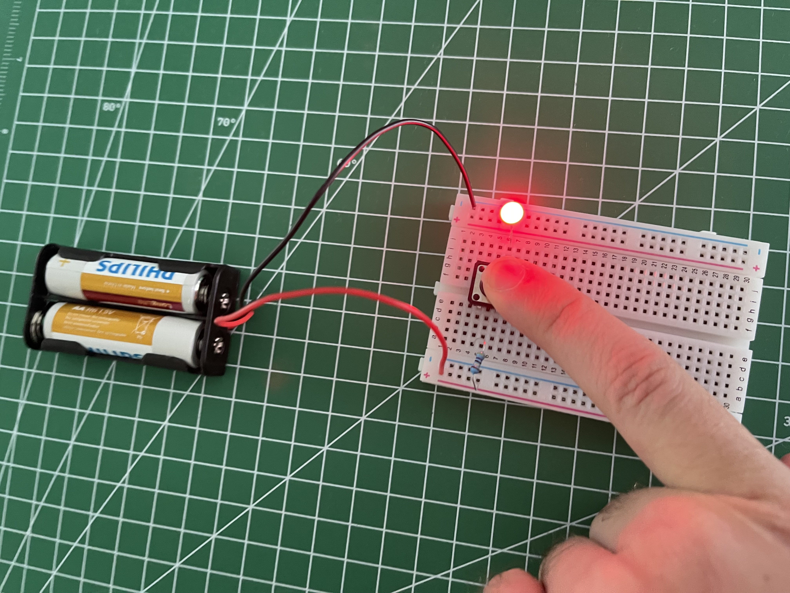

# Basic LED Control with a Push Button

This is a fundamental electronics circuit that demonstrates how to turn a Light Emitting Diode (LED) on and off using a momentary push button. When the button is pressed, the circuit is completed, and the LED lights up. When released, the circuit breaks, and the LED turns off.

---

## Components Used

* **LED:** 1x [Red 5mm] LED
* **Resistor:** 1x [49Ω] Resistor (as a current limiter)
* **Button:** 1x [12mm Momentary Tactile Push Button]
* **Power Source:** [3V] DC Power Supply (x2 AA Batteries Serially)
* **Misc:** Breadboard and Jumper Wires

---

## Schematic

Here is the circuit diagram for this setup.

---

## How It Works

This circuit is a simple series circuit.

1.  Power flows from the positive terminal of the power supply.
2.  The **push button** acts as a switch. By default, it's an open circuit, so no current can flow.
3.  When you press the button, it closes the switch, completing the circuit.
4.  Current then flows through the **resistor**. The resistor's job is crucial: it **limits the current** to a safe level for the LED. Without it, the LED would draw too much current and burn out. The value (e.g., 49Ω for a 3V supply) is chosen to provide enough current for the LED to be bright but not so much that it gets damaged.
5.  Finally, the current flows through the **LED**, causing it to light up, and then returns to the ground (negative) terminal of the supply.

---

## Breadboard Setup

A photo of the completed circuit on the breadboard.

