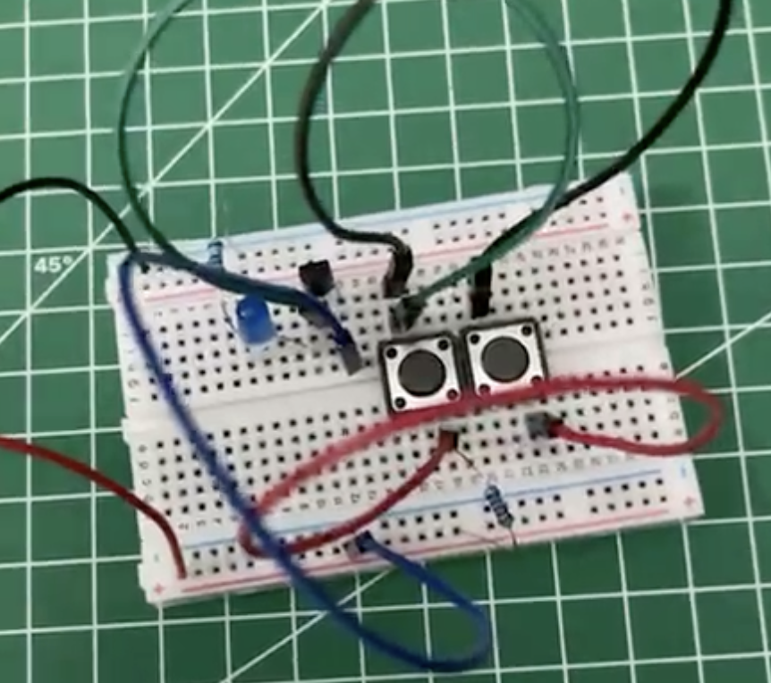
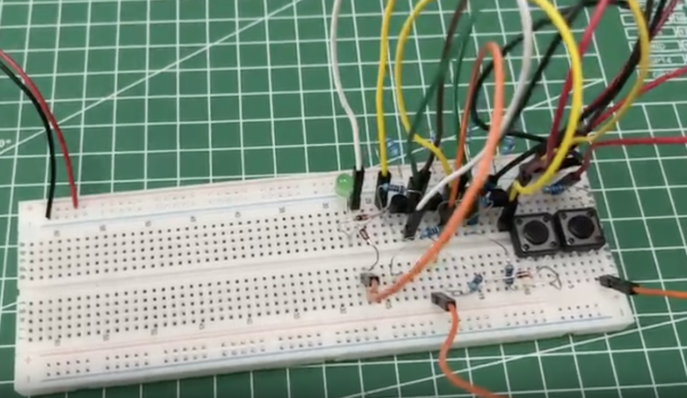

# Building Basic Logic Gates with Transistors

This project showcases the implementation of fundamental digital logic gates (**AND**, **OR**, **NOT**, **XOR**, and **BUFFER**) using basic electronic components like transistors on a breadboard. Each circuit demonstrates the core principles of digital electronics.

---

## AND Gate

An **AND** gate is a basic digital logic gate that implements logical conjunction. The output is HIGH (1) only when **both** of its inputs are HIGH (1).

#### Truth Table

| Input A | Input B | Output |
| :-----: | :-----: | :----: |
|    0    |    0    |   0    |
|    0    |    1    |   0    |
|    1    |    0    |   0    |
|    1    |    1    |   1    |

#### Schematic

#### Breadboard Setup

#### Demonstration
[Watch the AND Gate in action](./and.mp4)

---

## OR Gate

An **OR** gate is a digital logic gate that implements logical disjunction. The output is HIGH (1) if **one or more** of its inputs are HIGH (1).

#### Truth Table

| Input A | Input B | Output |
| :-----: | :-----: | :----: |
|    0    |    0    |   0    |
|    0    |    1    |   1    |
|    1    |    0    |   1    |
|    1    |    1    |   1    |

#### Schematic

#### Breadboard Setup

#### Demonstration
[Watch the OR Gate in action](./or.mp4)

---

### NOT Gate (Inverter)

**Schematic Symbol:**

**Demo / Principle of Operation:**

*Note: Click the image to watch the video.*

---

## XOR (Exclusive-OR) Gate

The **Exclusive-OR (XOR)** gate is a digital logic gate that gives a HIGH (1) output only if its two inputs are **different**.

#### Truth Table

| Input A | Input B | Output |
| :-----: | :-----: | :----: |
|    0    |    0    |   0    |
|    0    |    1    |   1    |
|    1    |    0    |   1    |
|    1    |    1    |   0    |

#### Schematic

#### Breadboard Setup

#### Demonstration
[Watch the XOR Gate in action](./xor.mp4)

---

## BUFFER Gate

A **BUFFER** gate doesn't perform any logical operation; its output is simply equal to its input. Buffers are primarily used to amplify a weak signal or to isolate different parts of a circuit.

#### Truth Table

| Input A | Output |
| :-----: | :----: |
|    0    |   0    |
|    1    |   1    |

#### Schematic

#### Breadboard Setup

